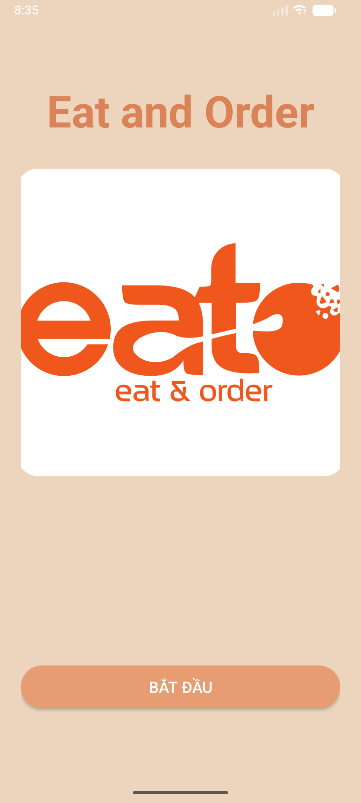
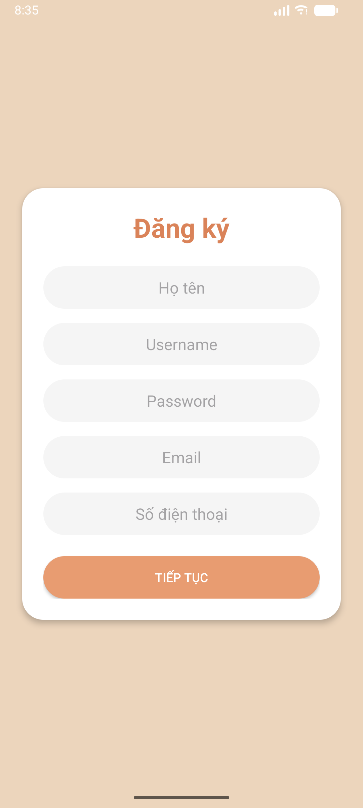
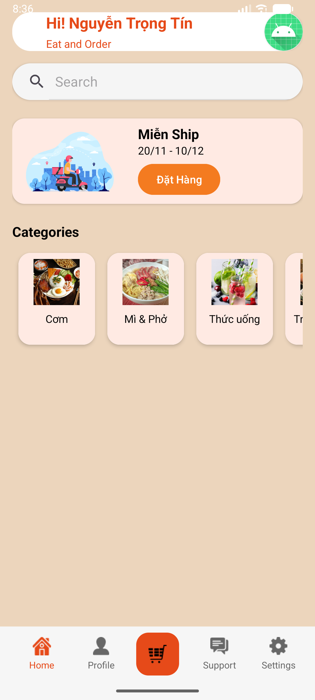
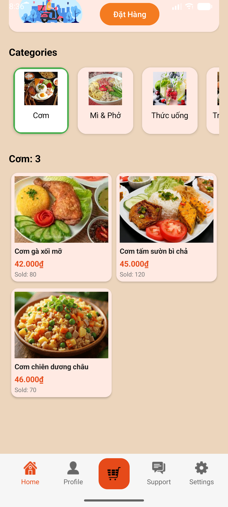

# 📱 EatAndOrder – Mobile App UI

---

Ứng dụng mô phỏng hệ thống đặt đồ ăn.
Dưới đây là giao diện (UI) nhóm đã xây dựng:

---

🖼️ 1. Màn hình Intro

---

🖼️ 2. Màn hình Đăng nhập

---

🖼️ 3. Màn hình Đăng ký

---

🖼️ 4. Màn hình Home

---

🖼️ 5. Màn hình Category (ngang)

---

🖼️ 6. Màn hình danh sách món ăn (Grid)

---

🖼️ 7. Bottom Navigation

